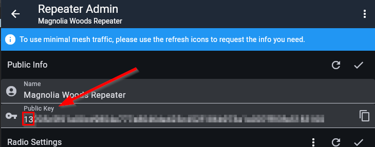
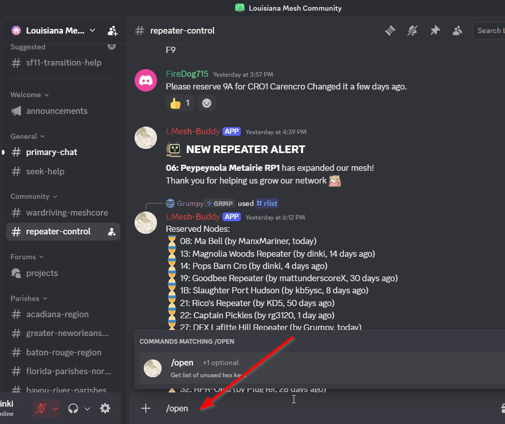
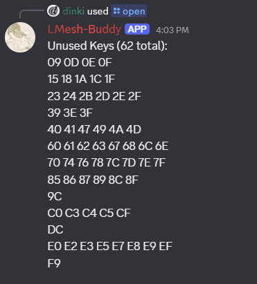
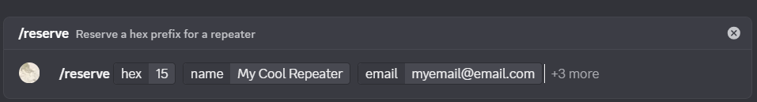
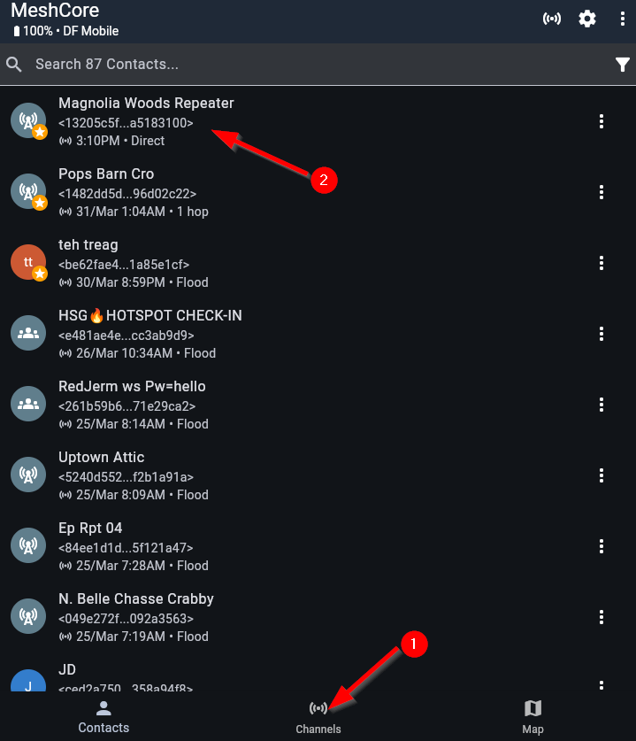
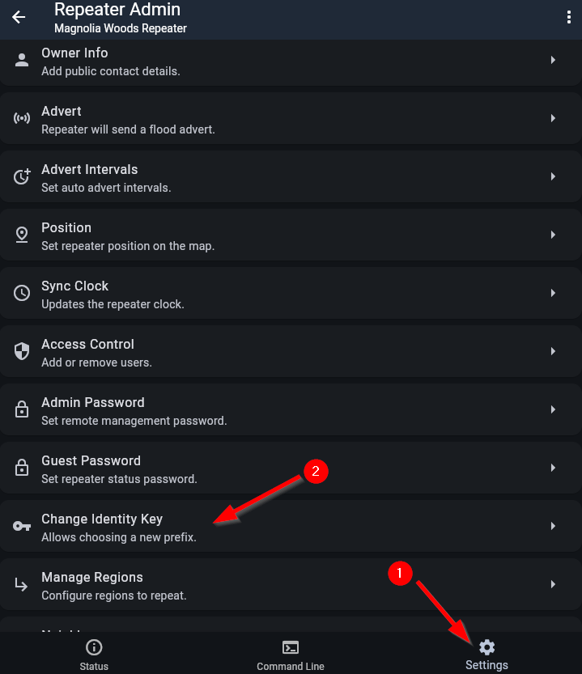

# Changing Your Repeater Public Key and Why You Should

## What is a public key

Meshcore creates a public key when you create your repeater. Your repeater is identified by the first two characters of the public key.

In this example the repeater is identified as `13`

## Why would I need to change my public key?

Due to the random way Meshcore issues these keys a high probability exists that another repeater may be issued a public key with the same first two characters. This poses a problem for identifying your repeater from any other that may already be using the same first two characters.

## How do I pick an unused public key and reserve it for my repeater?

The easiest way to check if your key is already in use, pick a new one if needed, and reserve that value is to get on the Louisiana Mesh Community Discord and join the `#repeater-control` channel. This is the link:

[Discord Invite Link](https://discord.gg/BcMTYc46)

[#repeater-control Link](https://discord.com/channels/1416518070415134732/1469207855075823680)

Once there, you can query the `LMesh-Buddy` bot by using slash commands.

Type `/open` in the message area and enter.

All keys listed by the bot are open and are available for use. If your key identifier is listed as open then you only need to reserve it. If your key identifier is not listed then you will need to select one from the list to reserve and change your public key. We'll assume that we will want to reserve the key identifier `15`

Once again we will issue a slash command to the bot. This time we will issue the `/reserve` command. When you do this you will get text entry boxes for the hex identifier (`15` for our example), the name you want to use for the repeater and email address. The email address is optional but it is advised to provide it as it can serve as a means to provide important information like settings changes or other important information. Your email will only be used for important communication and will not be shared. Additional information for longitude, latitude, and altitude are also available and are also optional. Once the information has been entered you can hit enter to issue the command. You should get confirmation that the hex key identifier has been reserved.

## How do I change my public key?

If you are fortunate, your key identifier was already available and nothing else needs to be done. If your key was not available and you had to choose one then you will need to change your public key on your repeater. Don't worry, this is easy.

Open your companion app and click on `Contacts` (1) and then click on your repeater name (2). Enter your repeater admin password and click log in.

Once logged in click `Settings` (1) and then scroll down and find `Change Identity Key` (2) and click it. A new screen will display with the option `Choose Prefix`. Select that option. A popup will show saying `Choose New Prefix`. Enter the new value that you reserved with the Discord bot and click `Ok`. Click the check mark at the top right of the screen to set the value. You will be warned that you are changing things. Answer that you want to proceed. A new key will be issued. Last, a popup will appear and ask if you want to add the repeater to your contact with this new public key. Answer yes.

You may want to go back to your contacts list and delete the repeater instance with the old public key to avoid confusion when logging in later.

## How do I get help?

If any of this seems scary or unclear, feel free to join the Discord server using the link above and ask for help. Lots of friendly people are there for you and we all want you to succeed.
