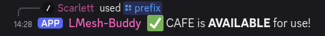
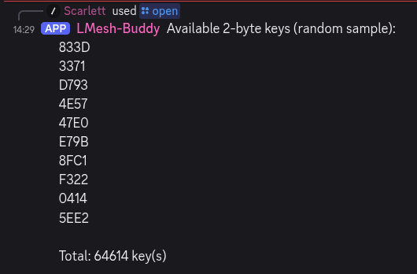

# Changing Your Repeater Public Key and When You Should

## What is a public key

Meshcore creates a public key when you create your repeater. Your repeater is identified by the first four characters of the public key.

## Why would I need to change my public key?

While we have moved to 2 byte, you may want to switch your key to a vanity prefix such as "C0DE"; or in the rare event it overlaps with another key on the network.

## How do I pick an unused public key and reserve it for my repeater?

The easiest way to check if the key is already in use, or pick a new one if needed, and reserve that value is to get on the Gulf Coast Mesh Discord and join the `#repeater-control` channel. This is the link:

[Discord Invite Link](https://discord.gg/BcMTYc46)

[#repeater-control Link](https://discord.com/channels/1416518070415134732/1469207855075823680)

Once there, you can query the `LMesh-Buddy` bot by using slash commands.

You can now run `/prefix` with a 4 vanity letters to check if it's avilable, If it is avilable then it will now no repeater using that prefix.

If you'd rather have one chosen randomly for yourself, simply run `/open` command without any arguments. The bot will generate a random 4 letter prefix that are open to use.

Once again we will issue a slash command to the bot. This time we will issue the `/reserve` command. When you do this you will get text entry boxes for the hex identifier (`CAFE` for our example), the name you want to use for the repeater and email address. The email address is optional but it is advised to provide it as it can serve as a means to provide important information like settings changes or other important information. Your email will only be used for important communication and will not be shared. Additional information for longitude, latitude, and altitude are also available and are also optional. Once the information has been entered you can hit enter to issue the command. You should get confirmation that the hex key identifier has been reserved.

## How do I get help?

If any of this seems scary or unclear, feel free to join the [Discord server](https://discord.gg/wT5JMs4MJe) and ask for help. Lots of friendly people are there for you and we all want you to succeed.
