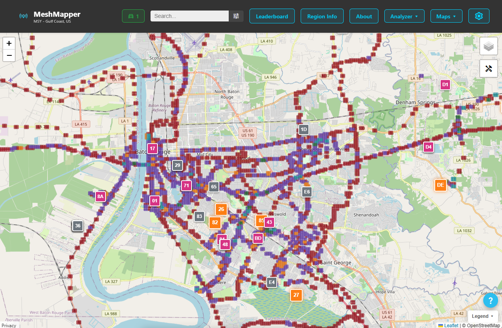
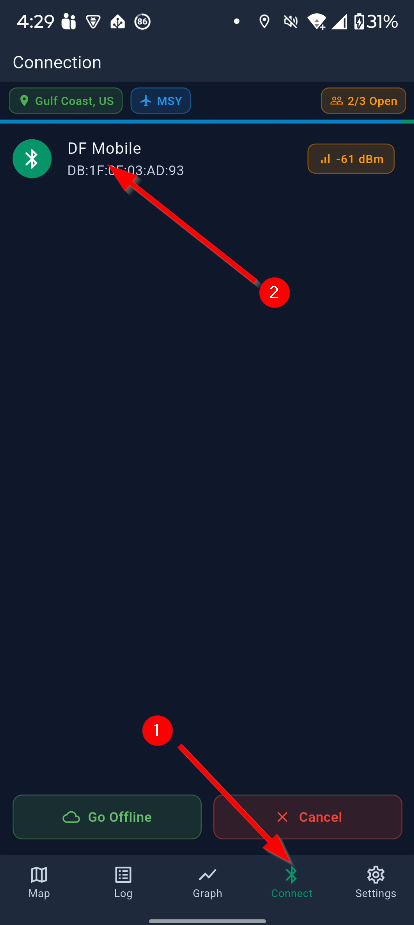
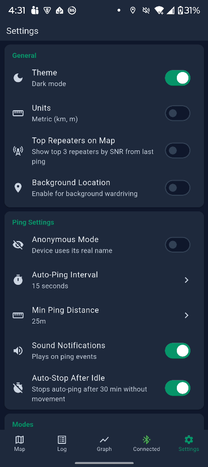
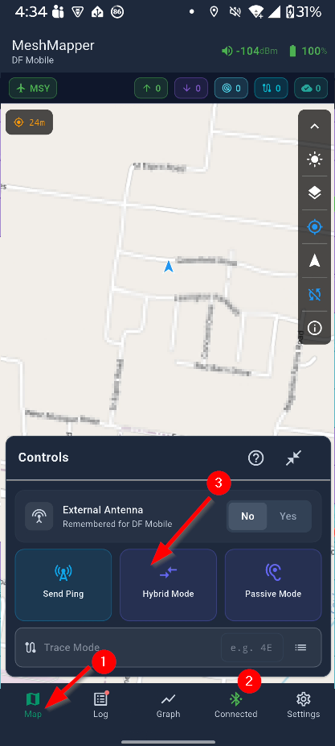
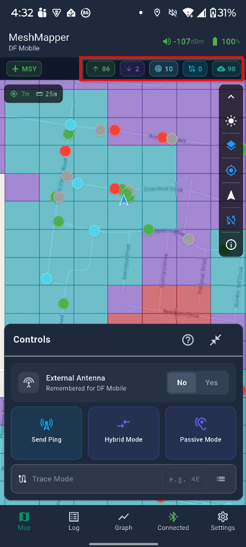
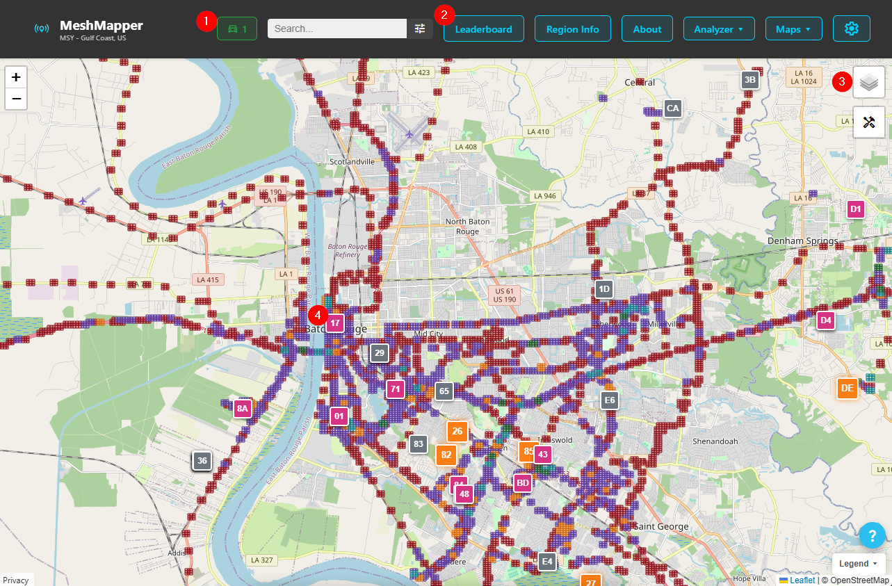
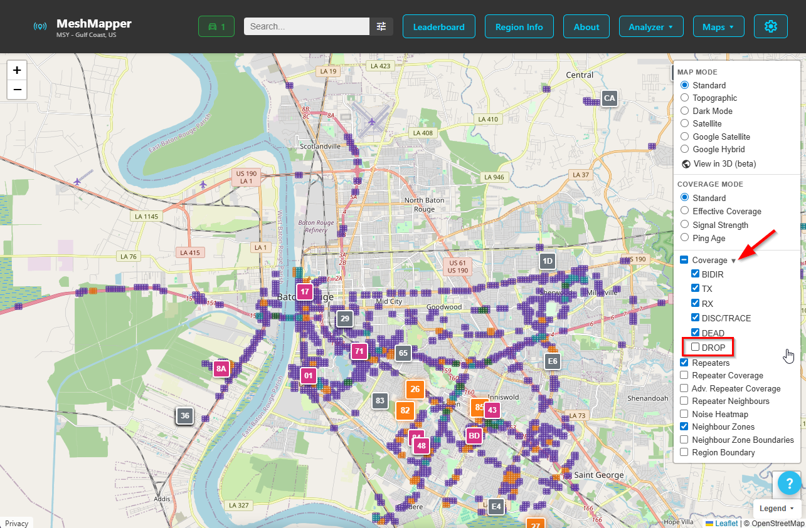
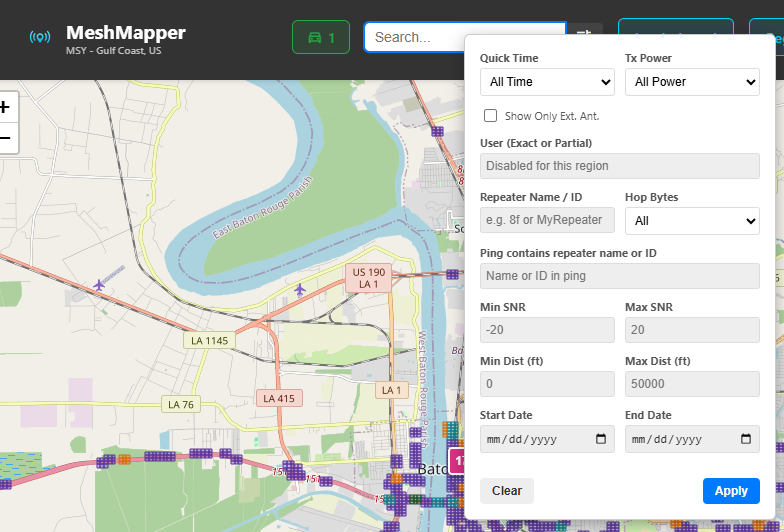
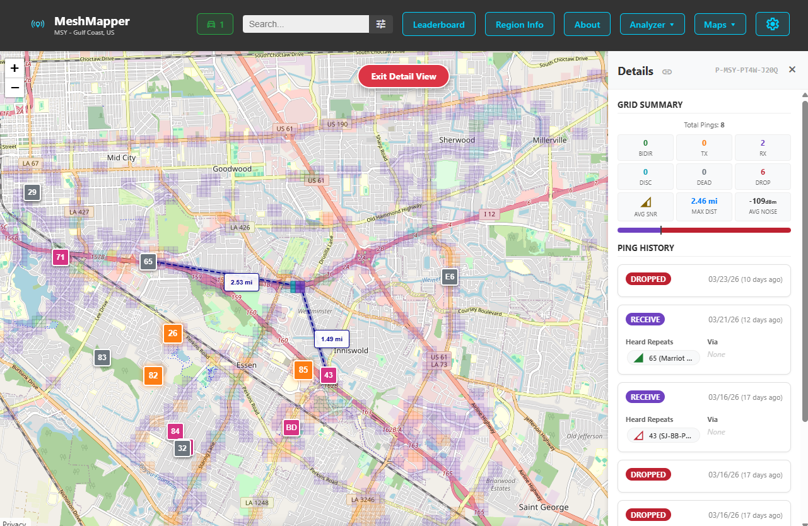

# Estimating coverage with MeshMapper

## What is MeshMapper

[From the Meshmapper.net website](https://meshmapper.net/) MeshMapper is described as:

> MeshMapper visualizes real-world MeshCore coverage using data collected by local mesh operators.

MeshMapper provides an estimate of coverage and information for a given area. This is not a perfect tool as it can provide false negatives for areas that do have coverage but it does not provide false positives. If you see an area marked with a reception you can feel confident that a repeater reached that area at that time.

MeshMapper mapping requires the use of a phone application in addition to a MeshCore companion device. The user opens the application, connects their companion device, turns on the mapping function and drives around. The application will send out a transmission at the user defined rate and listen for a short while for a response. If a response is heard that area will be marked as a reception area and if not it will be marked as a failure. These results are uploaded to the MeshMapper website. This will continue until the user stops the mapping function on their phone.

The data collected is shared with all to see and can help identify areas where an additional repeater would help extend the mesh. All are encouraged to contribute to the coverage data collection.

This document will discuss installing and using the app as well as using some of the basic functions of the website.

## Installing and Using the MeshMapper App

MeshMapper is available for both Android and iOS devices. Select the version for your phone and install:

[Android version via Google Play](https://play.google.com/store/apps/details?id=net.meshmapper.app)

[iOS version via App Store](https://apps.apple.com/us/app/meshmapper/id6758073991)

Once open you'll need to connect to your companion via bluetooth connection. Select `Connect` (1) from the bottom menu bar and then select your companion device (2).

Select the `Settings` option from the bottom bar and review the settings to fit your needs. Of particular interest is the `Auto-Ping Interval` which sets how often the ping will occur and `Sound Notifications` which plays a sound for each transmit and receive. This makes it easy to determine if you are getting coverage without having to look at the onscreen display.

Now that you have connected to the companion device and made the settings change you are ready to start mapping. Select `Map` (1) from the bottom bar, ensure that you are connected (2) and then click the `Hybrid Mode` button (3) to start mapping.

You will see the `Hybrid Mode` button text change from 'pinging' to 'listening' at the interval you set. Note that the app will only ping once for a given area and will skip if the minimum change distance is not reached before the next ping occurs.

Drive around for a while and you'll start seeing the phone display showing colored circles where transmits and receives occured as well as a colored grid represtenting the grid identified with those events. These can be reviewed on the phone or on the website. Press the `Hybrid Mode` button to end the mapping session when you are finished mapping.

You can also see the number of transmit, received and upload to web events in the area highlighted by the red box in the screenshot above.

See the [MeshMapper wiki page](https://wiki.meshmapper.net/) for much more information not covered in this brief guide.

## Using the MeshMapper website

The data collected by the MeshMapper application can be reviewed either through the application or through the web application. While both serve the same purpose, the website may offer an easier way to interact. See the Gulf Coast Mesh coverage listed on the MeshMapper MSY - Gulf Coast subdomain:

[Meshmapper Gulf Coast Mesh Coverage](https://msy.meshmapper.net/index.php)

It is beyond the scope of this introduction to MeshMapper guide to go over all features of the website but some important features will be discussed. See the [MeshMapper wiki page](https://wiki.meshmapper.net/) for more information.

Some of the features to highlight are `Active Mapper Count` (1) which shows how many users are mapping the region, `Leaderboard` (2) which shows a ranking of users and their contribution to mapping the region, `Layers submenu` (3) for controling the display, and `Repeater information` (4) which open statistics of repeaters that are recognized as members of the mesh network.

Of particular interest is the `Layers submenu` (3). This allows for adjusting many display aspects of the map. It also provides an easy way to filter out the areas noted as failed responses to show only positive hits. Do this by expanding the `Coverage` drop down and deselect `Drop`

Clicking the search box in the top menu bar opens an additional menu which allows you to customize things further. Of note is the `Ping contains repeater name or ID` text entry which allows the user to type in the two character repeater id to show only that repeater on the map. This is helpful in determining a repeater's coverage in areas where multiple repeaters are present. Additionally, the user can set the start and end dates to display to add additional control.

Lastly, clicking on any of the colored pings will open detailed information on the right side of the map display. This will include statistics, repeater reports and additional information for activity that happened in that area. The main display will also show distance from known stations and the current location.

**Note** The website does not auto refresh. You will need to click the refresh button on your browser to see any information collected after you initially loaded the page.

## Conclusion

This guide barely scratches the surface of the data provided by the MeshMapper application. It is encouraged that you explore these yourself and all are encouraged to participate in mapping areas so that it can be used by all. And it's fun too!
